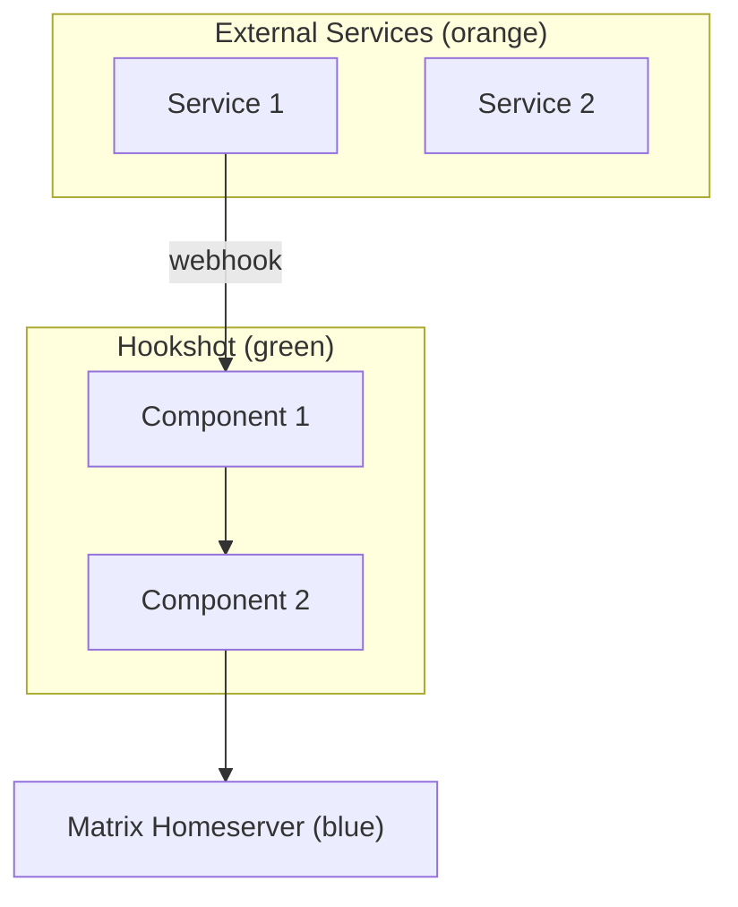
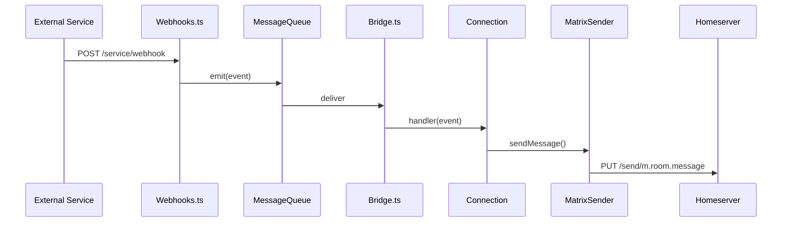
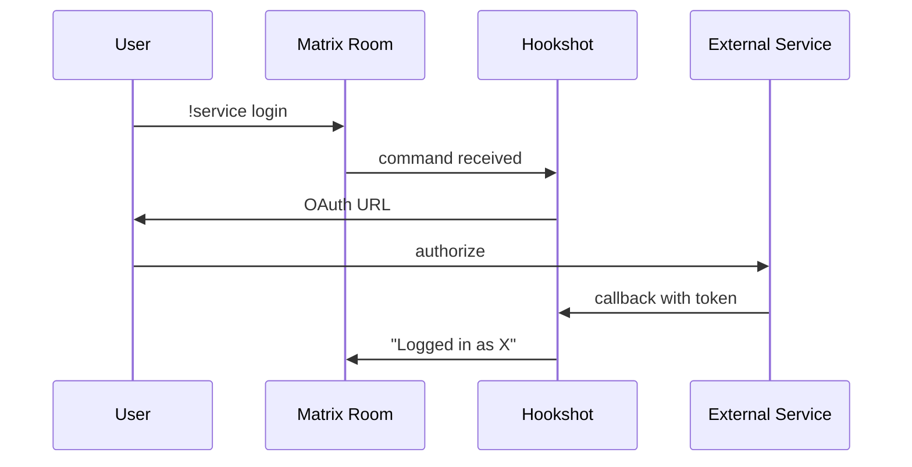
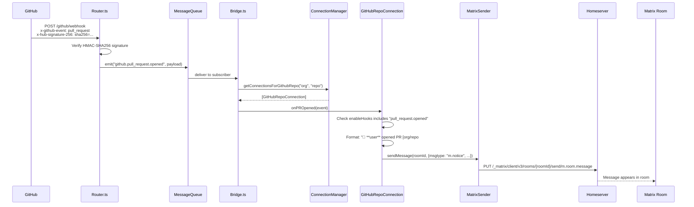

# Visual Strategy for Matrix Hookshot Documentation

---

## 1. Visual Philosophy

**Role of visuals:** Evidence, not decoration. Every image answers: what happens, what does it look like, or how does data flow.

**Trustworthy visuals:**
- Diagrams reflect actual code paths (verified against `src/`)
- Screenshots show real system output (not mockups)
- Sequence diagrams match actual event handler bindings in `src/Bridge.ts`

**What to avoid:**
- Marketing-style architecture diagrams that simplify away real complexity
- Screenshots from old versions without version annotation
- Diagrams that show planned features as if they exist
- Generic "cloud" boxes — name every component

---

## 2. Visual Language System

### Diagrams

**Color system:**
| Color | Meaning | Hex |
|---|---|---|
| Blue | Matrix components (homeserver, rooms, clients) | `#1976D2` |
| Green | Hookshot components (Bridge, ConnectionManager, etc.) | `#388E3C` |
| Orange | External services (GitHub, GitLab, JIRA, etc.) | `#F57C00` |
| Gray | Infrastructure (Redis, HTTP listeners, message queue) | `#616161` |
| Red | Error/failure states | `#D32F2F` |

**Shape types:**
| Shape | Represents |
|---|---|
| Rectangle | Service or component |
| Rounded rectangle | Process or handler |
| Cylinder | Storage (Redis, Matrix state) |
| Diamond | Decision point |
| Person icon | User or bot |

**Flow conventions:**
- Left-to-right for data flow
- Top-to-bottom for sequence/time
- Dashed lines for async/message queue
- Solid lines for synchronous calls

**Labeling:**
- Every arrow has a label (event name, HTTP method, or data type)
- Components show file path: `Bridge.ts` not just "Bridge"
- External services use their proper names and (optionally) brand icons

### Screenshots

**Framing rules:**
- Crop to relevant area — no full-screen screenshots
- Include enough context to identify where this appears (room name visible, client chrome visible)
- Dark theme screenshots (matches Element default) unless showing theme-specific behavior

**Annotations:**
- Red arrows or boxes for callouts
- Numbered callouts for step-by-step flows
- Text annotations outside the screenshot, not overlaid

### UI element representation

| Actor | Visual treatment |
|---|---|
| Hookshot bot | Bot avatar + `m.notice` message styling (gray text in Element) |
| Human user | Regular message styling |
| External service event | Formatted notice with emoji prefix (as hookshot actually sends them) |
| Bot command | User message starting with `!gh` or `!hookshot` prefix |
| Error response | Red-highlighted or warning-styled message |

---

## 3. Visual Categories

### System overview diagrams
- **When:** `understand/` section, architecture overview
- **Must show:** All components, their relationships, trust boundaries
- **Style:** Component diagram with color coding

### Sequence diagrams
- **When:** Event lifecycle, integration flows, auth flows
- **Must show:** Every participant, every message, timing order
- **Style:** Mermaid `sequenceDiagram` with participants matching color system

### Integration flow diagrams
- **When:** Each integration page
- **Must show:** External service → hookshot → Matrix, with specific event names
- **Style:** Simplified sequence or flow diagram

### Chatroom screenshots
- **When:** Integration pages (showing what messages look like), tutorials
- **Must show:** Actual Matrix client rendering of hookshot messages
- **Style:** Cropped Element screenshots with annotations

### Widget/UI screenshots
- **When:** User guides for widget configuration
- **Must show:** The hookshot widget UI in Element
- **Style:** Cropped with step numbers for multi-step flows

### Configuration flow diagrams
- **When:** Operator guides
- **Must show:** Config file → component → behavior chain
- **Style:** Simple flow diagram

### Troubleshooting visuals
- **When:** Troubleshooting pages
- **Must show:** Error states, log output, diagnostic commands
- **Style:** Terminal screenshots or log excerpts in code blocks (prefer code blocks over screenshots for text)

---

## 4. Screenshot Strategy

### Chatroom screenshots needed

| Scenario | Integration | Shows |
|---|---|---|
| PR opened notification | GitHub | Formatted PR message with 🔵 emoji, title, author, link |
| Issue created notification | GitHub | Formatted issue message with 📥 emoji |
| PR review notification | GitHub | ✅ or 🔴 emoji with review verdict |
| Push notification | GitHub | Commit count, branch, compare link |
| `!gh create` command | GitHub | User command + bot response |
| Emoji reaction → GitHub action | GitHub | User reacts with 🗑️, issue closes |
| Merge request notification | GitLab | MR notification message |
| JIRA ticket notification | JIRA | Ticket created/updated message |
| Generic webhook message | Webhooks | Raw JSON → formatted message |
| Transformed webhook | Webhooks | Custom transformation result |
| RSS feed entry | Feeds | Feed notification message |
| Bot command listing | General | `!hookshot help` output |

### Widget screenshots needed

| Screen | Shows |
|---|---|
| Connection list | Widget showing all connections in a room |
| GitHub repo setup | Form for connecting a GitHub repo |
| Generic webhook setup | Webhook URL display after creation |
| Auth flow | OAuth redirect prompt |

### How to generate

**Test environment:**
- Synapse (via docker-compose or Testcontainers, as existing E2E tests use)
- Hookshot instance with test config
- Element Web for screenshots (Playwright controls the browser)
- Test GitHub/GitLab/JIRA accounts or mock servers

**Scripting:**
- Playwright scripts that:
  1. Log into Element as test user
  2. Navigate to test room
  3. Send bot commands / trigger webhooks via HTTP
  4. Wait for message to render
  5. Capture screenshot of message area
  6. Crop and annotate

---

## 5. Automated Screenshot Pipeline

### Architecture

```
┌─────────────────────────────────────────────────┐
│  CI Pipeline (GitHub Actions)                    │
│                                                  │
│  1. Start Synapse + Hookshot (docker-compose)    │
│  2. Create test rooms + connections              │
│  3. Run scenario scripts (Playwright)            │
│  4. Capture screenshots                          │
│  5. Compare with stored baselines                │
│  6. Update if intentional, fail if unexpected    │
└─────────────────────────────────────────────────┘
```

### Environment setup

```yaml
# docker-compose.screenshots.yml
services:
  synapse:
    image: matrixdotorg/synapse:latest
    # ... test config
  hookshot:
    build: .
    environment:
      - HOOKSHOT_CONFIG=/config/test-screenshots.yml
    depends_on: [synapse]
  element:
    image: vectorim/element-web:latest
    ports: ["8080:80"]
```

### Scenario script structure

```typescript
// scripts/screenshots/github-pr-opened.ts
import { test } from '@playwright/test';

test('GitHub PR opened notification', async ({ page }) => {
  // 1. Login to Element
  await page.goto('http://localhost:8080');
  await login(page, 'test-user', 'password');

  // 2. Navigate to test room
  await navigateToRoom(page, '#hookshot-test:localhost');

  // 3. Trigger webhook
  await fetch('http://localhost:9000/github/webhook', {
    method: 'POST',
    headers: {
      'x-github-event': 'pull_request',
      'x-hub-signature-256': computeSignature(payload),
    },
    body: JSON.stringify(prOpenedPayload),
  });

  // 4. Wait for message
  await page.waitForSelector('.mx_EventTile:has-text("opened a new PR")');

  // 5. Screenshot
  const message = page.locator('.mx_EventTile:last-child');
  await message.screenshot({ path: 'assets/screenshots/integration-github-pr-opened.png' });
});
```

### Storage and versioning

- Screenshots stored in `docs/assets/screenshots/` (git-tracked)
- Naming: `{section}-{slug}[-{qualifier}].png`
- Baseline comparison: pixel diff with threshold (e.g., 5% tolerance for font rendering)
- Update workflow: `yarn screenshots:update` regenerates all, developer reviews diff

---

## 6. Scenario Library

Each scenario produces screenshots + example payloads reusable across docs.

### Core scenarios

| ID | Scenario | Produces |
|---|---|---|
| `gh-pr-opened` | GitHub PR opened webhook | Screenshot + webhook payload + Matrix event |
| `gh-issue-created` | GitHub issue created | Screenshot + payloads |
| `gh-command-create` | `!gh create "Bug"` command | Screenshot of command + response |
| `gh-emoji-close` | React with 🗑️ to close issue | Screenshot of reaction + confirmation |
| `gl-mr-opened` | GitLab merge request | Screenshot + payloads |
| `jira-ticket-created` | JIRA issue created | Screenshot + payloads |
| `webhook-raw` | Generic webhook POST | Screenshot + payload |
| `webhook-transform` | Webhook with transformation | Screenshot showing custom format |
| `feed-new-entry` | RSS feed new item | Screenshot |
| `bot-help` | `!hookshot help` | Screenshot of command listing |
| `widget-connect` | Widget UI: connect GitHub repo | Screenshot sequence (3-4 screens) |
| `widget-list` | Widget UI: list connections | Screenshot |

### Scenario output structure

```
scenarios/
├── gh-pr-opened/
│   ├── scenario.ts              # Playwright script
│   ├── webhook-payload.json     # Input webhook
│   ├── matrix-event.json        # Resulting Matrix event
│   ├── screenshot.png           # Captured screenshot
│   └── README.md                # What this scenario tests
```

---

## 7. Diagram Generation Strategy

### Tool: Mermaid

**Why Mermaid:**
- Text-based (version controlled, diffable)
- Renders in GitHub, most doc frameworks
- Sufficient for sequence, flow, component, and state diagrams
- No external tool dependency

**When NOT Mermaid:**
- Complex system context diagrams with custom positioning → SVG (hand-crafted or D2/Graphviz)
- Diagrams needing brand icons → SVG with embedded images

### Standard templates

**System context template:**


**Event flow template:**


**Auth flow template:**


### Maintenance rules

- Every diagram has a source `.mmd` file in `docs/assets/diagrams/`
- Diagrams in docs use `include` or inline Mermaid (framework-dependent)
- Diagram changes require PR review (visual diff in CI if possible)
- Each diagram references the code it represents in a comment: `%% Source: src/Bridge.ts:300-500`

---

## 8. Visual Evidence Blocks

### Embedding format

```markdown
<!-- In the doc page: -->


*A pull request notification from hookshot in an Element room. The message includes
the PR title, author, and link. [Code: src/Connections/GithubRepo.ts:1377-1439]*

```

### Caption rules

Every visual must have:
1. **Alt text** (accessibility) — describes what the image shows
2. **Caption** (below image) — explains what the reader should notice
3. **Source reference** — code file or scenario that produced this visual

### Placement rules

- Screenshots appear immediately after the text that describes the behavior they show
- Sequence diagrams appear at the start of "How it works" sections
- System diagrams appear once per section, not repeated

---

## 9. Theme and Identity

### Color palette

| Use | Color | Hex | Notes |
|---|---|---|---|
| Matrix / homeserver | Blue | `#1976D2` | Matches Matrix brand |
| Hookshot | Green | `#388E3C` | Distinct from Matrix blue |
| External services | Orange | `#F57C00` | Warm, attention-drawing |
| Infrastructure | Gray | `#616161` | Background, non-primary |
| Error / danger | Red | `#D32F2F` | Warnings and failures |
| Success | Teal | `#00897B` | Confirmations |

### External service representation

- Use service brand colors in their own diagrams/icons where helpful
- In hookshot system diagrams, all external services use orange (consistency over brand fidelity)
- Service logos may appear in the integration overview page capability matrix

### Diagram tone

- Technical, not illustrative
- Labeled, not decorative
- Minimal — show only what's needed to understand the point
- Consistent spacing and alignment

---

## 10. What Breaks Over Time

| Failure | Detection | Fix |
|---|---|---|
| Screenshots show old UI | Visual diff in CI against baselines | Re-run screenshot pipeline |
| New UI elements not captured | Coverage check: each integration page lists required screenshots | Add to scenario library |
| Diagrams reference renamed components | Grep diagram source files for component names | Update diagram + reference comment |
| Color inconsistency in new diagrams | Mermaid theme config enforces palette | Define theme in `mermaid.config.json` |
| New integration missing visuals | CI check: integration pages must have ≥1 diagram + ≥1 screenshot placeholder | Fail PR if missing |
| External service UI changes (e.g., GitHub App setup) | These screenshots are manual — flag with `last_verified` date | Quarterly re-verification |

---

## 11. Tooling Recommendations

| Tool | Purpose | Why |
|---|---|---|
| **Playwright** | Screenshot automation | Already in JS ecosystem, headless Chrome, network interception |
| **Mermaid** | Diagram source | Text-based, git-friendly, renders everywhere |
| **mermaid-cli** (`mmdc`) | Diagram rendering to SVG/PNG | CI rendering without browser |
| **sharp** | Image optimization | Fast, Node.js native, auto-crop/resize |
| **pixelmatch** | Screenshot comparison | Pixel diff for CI baseline comparison |
| **Element Web** | Screenshot target | The primary Matrix client, represents real user experience |

### CI integration

```yaml
# .github/workflows/docs-visuals.yml
docs-screenshots:
  runs-on: ubuntu-latest
  steps:
    - uses: actions/checkout@v4
    - run: docker-compose -f docker-compose.screenshots.yml up -d
    - run: npx playwright test scripts/screenshots/
    - run: node scripts/compare-screenshots.js  # pixel diff against stored baselines
    - uses: actions/upload-artifact@v4
      with:
        name: screenshots
        path: docs/assets/screenshots/
```

---

## 12. MVP vs Ideal

### MVP (implement first)

- **Mermaid diagrams** for all sequence and flow diagrams (inline in markdown)
- **Manual screenshots** with strict naming convention and `last_verified` dates
- **Scenario library** as documentation (JSON payloads in `assets/payloads/`)
- **Color system** defined in a shared Mermaid theme config
- **Evidence density targets** enforced in PR review (not CI)

**Effort:** ~2 days for diagrams, ~1 day for screenshot capture, ongoing for new integrations.

### Ideal (implement later)

- **Automated screenshot pipeline** with Playwright + docker-compose
- **CI baseline comparison** for screenshot regression detection
- **Auto-generated diagrams** from code annotations (e.g., generate sequence diagrams from `bindHandlerToQueue` calls)
- **Scenario library** that produces both screenshots and example payloads for docs
- **Visual coverage check** in CI: every integration page must have required visuals

**Effort:** ~1-2 weeks for pipeline, ongoing maintenance.

---

## 13. Example: GitHub PR → Matrix Message

### Mermaid sequence diagram



Source: `src/github/Router.ts:74-99`, `src/Bridge.ts:404-413`, `src/Connections/GithubRepo.ts:1377-1439`

### Screenshot plan

**Scenario script:** `scenarios/gh-pr-opened/scenario.ts`
1. Start test environment (Synapse + Hookshot + Element)
2. Create room, connect to test GitHub repo
3. POST mock PR webhook to `/github/webhook`
4. Wait for message in Element
5. Screenshot the message tile

**Expected output:** A cropped Element screenshot showing:
- Bot avatar (hookshot)
- Message: "🔵 **octocat** opened a new PR [test-org/test-repo#42](https://github.com/...): "Fix login bug""
- Gray `m.notice` styling

### How it appears in docs

```markdown
## Example: Pull request notification

When a pull request is opened on a connected repository, hookshot sends a
formatted notification to the Matrix room.


*Pull request opened notification. Hookshot formats the message with the PR
author, title, and link. The 🔵 emoji indicates a new PR.*

The resulting Matrix event:

​```json
{
  "type": "m.room.message",
  "content": {
    "msgtype": "m.notice",
    "body": "🔵 **octocat** opened a new PR test-org/test-repo#42: \"Fix login bug\"",
    "formatted_body": "🔵 <strong>octocat</strong> opened a new PR <a href=\"...\">test-org/test-repo#42</a>: \"Fix login bug\"",
    "format": "org.matrix.custom.html",
    "external_url": "https://github.com/test-org/test-repo/pull/42",
    "uk.half-shot.matrix-hookshot.github.repo": {
      "id": 123,
      "full_name": "test-org/test-repo"
    },
    "uk.half-shot.matrix-hookshot.github.pull_request": {
      "id": 456,
      "number": 42,
      "title": "Fix login bug"
    }
  }
}
​```

[Code: src/Connections/GithubRepo.ts:1377-1439]
[Scenario: scenarios/gh-pr-opened/]
```

---

## 14. Final Summary

**How this visual system improves understanding:**
- Sequence diagrams show the actual event path through named source files, not abstract boxes
- Screenshots show what users actually see in their Matrix client
- Every visual has a code reference — readers can verify the diagram matches reality

**How it builds trust:**
- No mockups or idealized diagrams — everything is reproducible
- Automated pipeline catches visual regressions
- Consistent color system means readers learn the visual language once

**How it stays consistent:**
- Mermaid theme config enforces colors
- Naming conventions prevent ad-hoc screenshot sprawl
- CI checks enforce minimum visual evidence per page type
- Scenario library is reusable — adding a new integration means adding scenarios, not reinventing the visual approach
