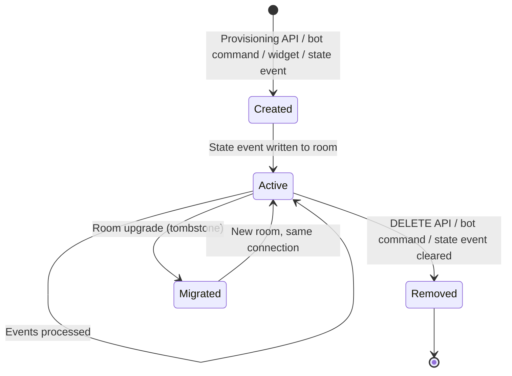

# Connections

A Connection is hookshot's central abstraction. It is a bidirectional binding between a Matrix room and an external service resource (a GitHub repo, a JIRA project, an RSS feed, a webhook endpoint).

Every integration in hookshot is implemented as a Connection subclass. Understanding this abstraction explains how hookshot works as a coherent system rather than a collection of adapters.

## The Connection interface

All connections implement `IConnection` (defined in `src/Connections/IConnection.ts:30-117`):

```typescript
interface IConnection {
  roomId: string;
  connectionId: string;       // Opaque hash of roomId + type + stateKey

  // Inbound event handlers (optional — implement what you handle)
  onStateUpdate?(ev: MatrixEvent): Promise<void>;
  onEvent?(ev: MatrixEvent): Promise<void>;
  onMessageEvent?(ev, checkPermission, parentEvent?): Promise<boolean>;

  // GitHub-specific inbound handlers (defined on interface, implemented by GitHub connections)
  onIssueCreated?(ev): Promise<void>;
  onIssueStateChange?(ev): Promise<void>;
  onIssueEdited?(ev): Promise<void>;
  // ... more service-specific handlers

  // Lifecycle
  isInterestedInStateEvent(eventType: string, stateKey: string): boolean;
  migrateToNewRoom?(newRoomId: string): Promise<void>;
  onRemove?(): Promise<void>;

  // Provisioning
  getProvisionerDetails?(showSecrets?: boolean): GetConnectionsResponseItem;
  provisionerUpdateConfig?<T>(userId: string, config: T): Promise<void>;
}
```

The base class `BaseConnection` (`src/Connections/BaseConnection.ts:7-23`) provides:
- `roomId` storage
- `stateKey` storage
- `canonicalStateType` declaration
- `connectionId` computed as a hash of `roomId + type + stateKey`
- Default `priority` (-1)

> **Source:** [`src/Connections/IConnection.ts:30-117`](https://github.com/matrix-org/matrix-hookshot/blob/main/src/Connections/IConnection.ts#L30-L117) · [`src/Connections/BaseConnection.ts:7-23`](https://github.com/matrix-org/matrix-hookshot/blob/main/src/Connections/BaseConnection.ts#L7-L23)

## Connection types

Hookshot has **15 connection classes** across 8 services, plus `SetupConnection` for provisioning:

| Class | Service | State event type | Bot commands | Inbound handlers | Provisioning |
|---|---|---|---|---|---|
| `GitHubRepoConnection` | GitHub | `...github.repository` | 4 (`create`, `close`, `assign`, `workflow run`) | 15 handlers | Yes |
| `GitHubIssueConnection` | GitHub | `...github.issue` | None | 3 handlers | No |
| `GitHubDiscussionConnection` | GitHub | `...github.discussion` | None | 1 handler | No |
| `GitHubDiscussionSpace` | GitHub | `...github.discussion.space` | None | None | Yes |
| `GitHubProjectConnection` | GitHub | `...github.project` | None | None | Yes |
| `GitHubUserSpace` | GitHub | `...github.user.space` | None | None | Yes |
| `GitLabRepoConnection` | GitLab | `...gitlab.repository` | 3 (`create`, `create-confidential`, `close`) | 12 handlers | Yes |
| `GitLabIssueConnection` | GitLab | `...gitlab.issue` | None | 3 handlers | No |
| `JiraProjectConnection` | JIRA | `...jira.project` | 3 (`create`, `issue-types`, `assign`) | 3 handlers | Yes |
| `GenericHookConnection` | Webhooks | `...generic.hook` | None | 1 handler | Yes |
| `OutboundHookConnection` | Webhooks | `...outbound-hook` | None | None | Yes |
| `FeedConnection` | Feeds | `...feed` | None | 3 handlers | Yes |
| `FigmaFileConnection` | Figma | `...figma.file` | None | 1 handler | Yes |
| `OpenProjectConnection` | OpenProject | `org.matrix.matrix-hookshot.openproject.project` | 5 (`create`, `close`, `priority`, `assign`, `responsible`) | 2 handlers | Yes |
| `HoundConnection` | ChallengeHound | `...challengehound.activity` | None | 1 handler | Yes |
| `SetupConnection` | (all) | N/A | 18+ setup commands | None | N/A |

State event type prefix: `uk.half-shot.matrix-hookshot.` (except OpenProject which uses `org.matrix.matrix-hookshot.`)

> **Source:** [`src/Connections/`](https://github.com/matrix-org/matrix-hookshot/blob/main/src/Connections/)

## Connection lifecycle



### Creation

A connection comes into existence through one of four paths. All paths end with a Matrix room state event being written:

**1. Bot command** — User sends `!hookshot github repo https://github.com/org/repo` in a room. `SetupConnection` handles the command, validates the input, and writes the state event.

> **Source:** [`src/Connections/SetupConnection.ts`](https://github.com/matrix-org/matrix-hookshot/blob/main/src/Connections/SetupConnection.ts)

**2. Provisioning API** — `POST /widgetapi/v1/{roomId}/connections/{type}` with connection config. `ConnectionManager.provisioning()` calls the connection type's static `provisionConnection()` method.

> **Source:** [`src/widgets/BridgeWidgetApi.ts:28-122`](https://github.com/matrix-org/matrix-hookshot/blob/main/src/widgets/BridgeWidgetApi.ts#L28-L122) · [`src/ConnectionManager.ts:91`](https://github.com/matrix-org/matrix-hookshot/blob/main/src/ConnectionManager.ts#L91)

**3. Widget UI** — The web widget (served from `web/`) calls the provisioning API. Same path as above, different frontend.

**4. Direct state event** — A client or tool sets the room state event directly (e.g., `uk.half-shot.matrix-hookshot.github.repository` with appropriate content). On next sync, hookshot picks it up.

### State storage

Connection configuration is stored as **Matrix room state events**. This is hookshot's most distinctive architectural choice.

Each connection type defines a canonical state event type (e.g., `uk.half-shot.matrix-hookshot.github.repository`). The state key identifies the specific resource (e.g., `org/repo`).

Example state event for a GitHub repo connection:

```json
{
  "type": "uk.half-shot.matrix-hookshot.github.repository",
  "state_key": "my-org/my-repo",
  "content": {
    "org": "my-org",
    "repo": "my-repo",
    "enableHooks": [
      "issue.created",
      "issue.changed",
      "pull_request.opened",
      "pull_request.closed",
      "pull_request.merged",
      "pull_request.reviewed",
      "release.created"
    ],
    "commandPrefix": "!gh",
    "showIssueRoomLink": false
  }
}
```

**Implications of this choice:**

| Property | Consequence |
|---|---|
| No external database needed | Simplifies deployment — no Postgres/MySQL to manage |
| State travels with rooms | Room upgrades (tombstone events) carry connection config |
| Federation-compatible | State is replicated across federated homeservers |
| No ad-hoc queries | Can't query "all connections for org X" — must scan all rooms |
| Startup cost | On start, hookshot must load state from every room it's in |
| State event size limits | Connection config must fit in a Matrix event (~65KB) |

> **Source:** [`src/Bridge.ts:1024-1115`](https://github.com/matrix-org/matrix-hookshot/blob/main/src/Bridge.ts#L1024-L1115)

### Startup reconstruction

When hookshot starts, it reconstructs all connections from room state:

1. Get list of all rooms the bot is in
2. For each room (2 concurrent workers):
   - Load room state events matching `uk.half-shot.matrix-hookshot.*` types
   - For each matching state event, create the corresponding Connection instance
   - Register with ConnectionManager

This is why hookshot doesn't need a database — the Matrix homeserver IS the database.

> **Source:** [`src/Bridge.ts:1024-1115`](https://github.com/matrix-org/matrix-hookshot/blob/main/src/Bridge.ts#L1024-L1115)

### Update

Connection config is updated by writing a new state event with the same type and state key. The connection's `onStateUpdate()` handler processes the change and updates internal state.

For generic webhooks, this includes recompiling transformation functions.

> **Source:** [`src/Connections/GenericHook.ts:531-560`](https://github.com/matrix-org/matrix-hookshot/blob/main/src/Connections/GenericHook.ts#L531-L560)

### Removal

Connections are removed by:
- `DELETE /widgetapi/v1/{roomId}/connections/{connectionId}` (provisioning API)
- Bot command (e.g., `!hookshot webhook remove {name}`)
- Clearing the state event content

The connection's `onRemove()` handler runs cleanup (e.g., removing webhook registrations from external services).

### Room migration

When a Matrix room is upgraded (tombstone event), hookshot migrates connections to the new room via `migrateToNewRoom()`. This copies the state events to the new room and removes them from the old one.

> **Source:** [`src/Bridge.ts`](https://github.com/matrix-org/matrix-hookshot/blob/main/src/Bridge.ts)

## CommandConnection

Connections that support bot commands extend `CommandConnection` instead of `BaseConnection`. This adds:

- `@botCommand` decorator support for defining commands
- Command prefix (e.g., `!gh`, `!gl`, `!jira`)
- Automatic help generation
- Permission checking before command execution

```typescript
// Example: GitHubRepoConnection extends CommandConnection
@botCommand("create", "Create an issue", ["title"], ["description", "labels"])
public async onCreateIssue(userId: string, title: string, ...): Promise<void> {
  // Create issue via Octokit API
}
```

> **Source:** [`src/Connections/CommandConnection.ts`](https://github.com/matrix-org/matrix-hookshot/blob/main/src/Connections/CommandConnection.ts) · [`src/BotCommands.ts:15-176`](https://github.com/matrix-org/matrix-hookshot/blob/main/src/BotCommands.ts#L15-L176)

## ConnectionManager

`ConnectionManager` (`src/ConnectionManager.ts`) is the registry for all active connections. It provides:

- **`push(...connections)`** — Register new connections, emit "new-connection" event
- **`getConnections()`** — Get all connections
- **`getInterestedForRoomState(roomId, eventType, stateKey)`** — Find connections interested in a state event
- **`getConnectionsForGithubRepo(owner, repo)`** — Service-specific lookup
- **`provisioning(roomId, intent, userId, type, data)`** — Create new connections via the provisioning flow

The manager maintains a flat array of all connections. Lookups filter by room ID, connection type, and service-specific criteria.

> **Source:** [`src/ConnectionManager.ts:47-100`](https://github.com/matrix-org/matrix-hookshot/blob/main/src/ConnectionManager.ts#L47-L100)

## Adding a new connection type

To add a new integration:

1. **Create a Connection class** in `src/Connections/` that extends `BaseConnection` (or `CommandConnection` if it needs bot commands)
2. **Define the state event type** as a static property
3. **Implement handlers** for inbound events (e.g., `onWebhookEvent()`)
4. **Implement provisioning** (`provisionConnection`, `getProvisionerDetails`)
5. **Register with ConnectionManager** — add to the connection type registry
6. **Add webhook routing** — if webhook-based, add a route in `Webhooks.ts`
7. **Add queue bindings** — in `Bridge.ts`, bind message queue topics to handlers
8. **Add config section** — if service needs global config (API keys, etc.)
9. **Add documentation** — follow the integration page template

> **Source:** See any connection class for reference. GenericHook.ts is the simplest webhook-based connection. FeedConnection.ts is the simplest polling-based connection.

## Related

**Concepts:** [Event Lifecycle](../understand/event-lifecycle.md) · [Integration Model](../understand/integration-model.md) · [Trust and Boundaries](../understand/trust-and-boundaries.md) · [Glossary](../understand/glossary.md)

**Integrations:** [Overview](../integrations/overview.md) · [GitHub (6 connection types)](../integrations/github.md) · [Generic Webhooks](../integrations/generic-webhooks.md)

**Reference:** [Event Types](../reference/event-types.md) — All state event types · [Bot Commands](../reference/bot-commands.md) · [Matrix Spec Map](../reference/matrix-spec-map.md)

**Operator:** [Configuration](../guides/operator/configuration.md#static-connections-optional) — Static connections · [Installation](../guides/operator/installation.md#create-the-registration-file) — Registration

**Troubleshooting:** [Connection Issues](../troubleshooting/connection-issues.md) · [Common Errors](../troubleshooting/common-errors.md)

**Matrix Spec:** [Room State Events](https://spec.matrix.org/latest/client-server-api/#room-state) · [Application Service API](https://spec.matrix.org/latest/application-service-api/)
