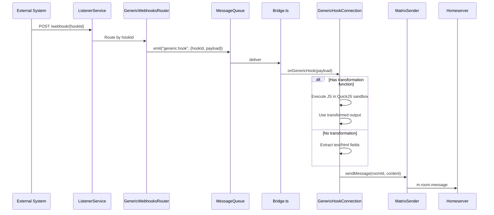

# Generic Webhooks

Generic webhooks accept any HTTP payload and deliver it to a Matrix room. No service-specific configuration required — any system that can send an HTTP POST can integrate with hookshot.

Two connection types:

| Type | State event | Direction | Purpose |
|---|---|---|---|
| GenericHookConnection | `uk.half-shot.matrix-hookshot.generic.hook` | Inbound | Receive external webhooks in Matrix |
| OutboundHookConnection | `uk.half-shot.matrix-hookshot.outbound-hook` | Outbound | Forward Matrix messages to external URL |

## Capabilities

| Capability | Supported |
|---|---|
| Receive events in Matrix | Yes — any HTTP POST |
| Send commands from Matrix | No (inbound only) |
| Outbound hooks | Yes — separate connection type |
| JavaScript transformation | Yes — QuickJS sandbox |
| Auth | URL-based (unique hookId) |
| Webhook-based | Yes |
| Bot commands | Setup via `!hookshot webhook` |
| Widget UI | Yes |
| Provisioning API | Yes |
| Encryption compatible | Yes |

## How it works — Inbound



<!-- Code: src/Connections/GenericHook.ts:639-737 -->

## Supported payload formats

| Content-Type | Handling |
|---|---|
| `application/json` | Parsed as JSON |
| `application/x-www-form-urlencoded` | Parsed as form data |
| `application/xml`, `text/xml` | Parsed via xml2js |
| `text/plain` | Passed as raw string |
| Other | Raw body as string |

<!-- Code: src/Connections/GenericHook.ts, webhook body parsing -->

## Message formatting

Without a transformation function, hookshot extracts messages from the payload using these fields:

| Field | Purpose |
|---|---|
| `text` | Plain text message body |
| `html` | HTML-formatted message body |
| `username` | Display name override for the message sender |

If none of these fields are present, the raw JSON is displayed.

Example payload:
```json
{
  "text": "Deploy to production succeeded",
  "html": "<b>Deploy to production</b> succeeded ✅",
  "username": "Deploy Bot"
}
```

Resulting Matrix message: `m.notice` with the formatted text.

<!-- Code: src/Connections/GenericHook.ts:601-632 -->

### Message size limits

Messages are trimmed to fit Matrix event size constraints (65,536 - 4,096 bytes for overhead).

<!-- Code: src/Connections/GenericHook.ts:692-712, MAX_EVENT_SIZE_BYTES -->

## Transformation functions

Transformation functions are JavaScript code that runs in a [QuickJS](https://bellard.org/quickjs/) sandbox. They transform the raw webhook payload into a custom Matrix message.

### v2 API (recommended)

```javascript
// The webhook data is available as `data`
// Set `result` to control the Matrix message
result = {
  version: "v2",
  plain: `Build ${data.build_number}: ${data.status}`,
  html: `<b>Build ${data.build_number}</b>: ${data.status}`,
  msgtype: "m.notice"  // or "m.text"
};
```

### v1 API (legacy)

```javascript
// Returns plain text only
result = `Build ${data.build_number}: ${data.status}`;
```

### Transformation function rules

- **500ms timeout** — functions that take longer are killed
- **No I/O** — no network access, no filesystem, no imports
- **Sandbox** — runs in QuickJS WASM, not Node.js
- **`data` variable** — contains the parsed webhook payload
- **`result` variable** — set this to control output. If `null`, no message is sent.

<!-- Code: src/Connections/GenericHook.ts:421-422, :548-550, :657-660 -->
<!-- Assumption: 500ms timeout mentioned in doc/DOCUMENTATION_ARCHITECTURE.md — needs verification in code -->

## Setup

### Enable in config

```yaml
generic:
  enabled: true
  urlPrefix: https://hookshot.example.com/webhook/
  # Optional: allow users to write JavaScript transformation functions
  allowJsTransformationFunctions: true
  # Optional: user ID prefix for webhook bot users
  userIdPrefix: _webhooks_
```

<!-- Code: src/config/sections/GenericHooks.ts -->

### Create a webhook (bot command)

In a Matrix room:

```
!hookshot webhook my-alerts
```

Response:

```
Webhook my-alerts created. URL: https://hookshot.example.com/webhook/<hookId>
```

<!-- Code: src/Connections/SetupConnection.ts — webhook setup command -->

### Create via provisioning API

```http
POST /widgetapi/v1/{roomId}/connections/GenericHook
Content-Type: application/json

{
  "name": "my-alerts",
  "transformationFunction": "result = { version: 'v2', plain: data.text };"
}
```

Response includes the webhook URL.

<!-- Code: src/Connections/GenericHook.ts:306-374 (provisionConnection) -->

### Manage webhooks

```
!hookshot webhook list          # List webhooks in this room
!hookshot webhook remove <name> # Remove a webhook
```

### Connection options

| Option | Type | Default | Description |
|---|---|---|---|
| `name` | string | required | Display name (3-64 chars) |
| `transformationFunction` | string | none | JavaScript transformation code |
| `waitForComplete` | boolean | false | Wait for processing before HTTP response |
| `hookId` | string | auto-generated | UUID for the webhook URL |
| `expirationDate` | ISO-8601 | none | When the webhook expires |

<!-- Code: src/Connections/GenericHook.ts:30-55 (GenericHookConnectionState) -->

## Outbound hooks

A separate connection type that forwards Matrix room messages to an external HTTP endpoint.

### Setup

```
!hookshot outbound-hook https://example.com/receive
```

When anyone sends a message in the room, hookshot POSTs it to the URL.

### State event

```json
{
  "type": "uk.half-shot.matrix-hookshot.outbound-hook",
  "state_key": "hook-name",
  "content": {
    "name": "hook-name",
    "url": "https://example.com/receive"
  }
}
```

<!-- Code: src/Connections/OutboundHook.ts:44-46 -->

## Example: CI notification

Send from your CI pipeline:

```bash
curl -X POST https://hookshot.example.com/webhook/<hookId> \
  -H "Content-Type: application/json" \
  -d '{
    "text": "Pipeline #123 failed on main",
    "html": "Pipeline <a href=\"https://ci.example.com/123\">#123</a> <b>failed</b> on main"
  }'
```

With a transformation function:

```javascript
// Transform GitHub Actions webhook format
const run = data.workflow_run;
const icon = run.conclusion === "success" ? "✅" : "❌";
result = {
  version: "v2",
  plain: `${icon} ${run.name} #${run.run_number}: ${run.conclusion}`,
  html: `${icon} <a href="${run.html_url}">${run.name} #${run.run_number}</a>: <b>${run.conclusion}</b>`
};
```

## Limitations

- **No webhook signature verification** — URLs rely on unique UUIDs for security. Anyone with the URL can send payloads.
- **500ms transformation timeout** — complex transformations may hit this limit
- **No async in transformations** — can't make HTTP calls or use promises in JavaScript functions
- **Legacy v1 transformation API** still supported but deprecated — no removal timeline
- **XML parsing uses xml2js** — verify current version against known CVEs

## Troubleshooting

| Symptom | Likely cause | Fix |
|---|---|---|
| Webhook returns 404 | hookId doesn't match any connection | Check URL, recreate webhook |
| Message not appearing | Transformation returned null | Test transformation logic |
| "waitForComplete timed out" | Processing taking too long | Check transformation complexity, see [#1251](https://github.com/matrix-org/matrix-hookshot/issues/1251) |
| Static webhook with transformation fails | QuickJS not initialized at startup | See [#1228](https://github.com/matrix-org/matrix-hookshot/issues/1228) |

## Related

- [Quickstart](../get-started/quickstart.md) — First webhook in 5 minutes
- [Event Lifecycle](../understand/event-lifecycle.md) — How events flow through hookshot
- [Architecture: Connections](../architecture/connections.md) — The Connection abstraction
