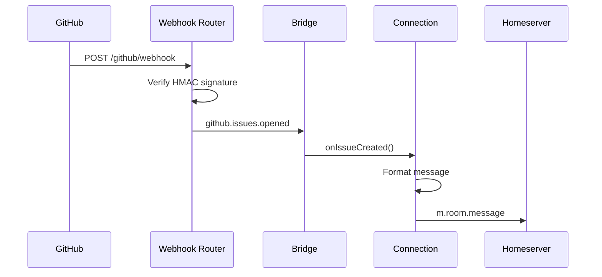

# GitHub

Hookshot connects Matrix rooms to GitHub repositories. It delivers notifications for pull requests, issues, pushes, releases, discussions, and workflow runs. It accepts bot commands to create issues, close PRs, assign users, and trigger workflows — directly from Matrix.

## Connection types

GitHub has 6 connection types:

| Type | State event | Purpose |
|---|---|---|
| Repository | `uk.half-shot.matrix-hookshot.github.repository` | Monitor repo events, run commands |
| Issue | `uk.half-shot.matrix-hookshot.github.issue` | Bridge a single issue to a dedicated room |
| Discussion | `uk.half-shot.matrix-hookshot.github.discussion` | Bridge a discussion thread |
| Discussion Space | `uk.half-shot.matrix-hookshot.github.discussion.space` | Matrix space for all repo discussions |
| Project | `uk.half-shot.matrix-hookshot.github.project` | Monitor a project board |
| User Space | `uk.half-shot.matrix-hookshot.github.user.space` | Space for user's notification stream |

Most users only need the **Repository** connection. The rest are for advanced use cases.

> **Source:** [`src/Connections/GithubRepo.ts:575`](https://github.com/matrix-org/matrix-hookshot/blob/main/src/Connections/GithubRepo.ts#L575)

## Capabilities

| Capability | Supported |
|---|---|
| Receive events in Matrix | Yes — 23 event types |
| Send commands from Matrix | Yes — 4 commands |
| Emoji reactions | Yes — reactions, close, reopen, approve |
| OAuth authentication | Yes — GitHub App + user OAuth |
| Webhook-based | Yes |
| Bot commands | Yes — `!gh` prefix |
| Widget UI | Yes |
| Provisioning API | Yes |
| Encryption compatible | Yes |
| GitHub Enterprise | Yes — custom `enterpriseUrl` |

## How it works



> **Source:** [`src/github/Router.ts:74-99`](https://github.com/matrix-org/matrix-hookshot/blob/main/src/github/Router.ts#L74-L99) · [`src/Bridge.ts:315-325`](https://github.com/matrix-org/matrix-hookshot/blob/main/src/Bridge.ts#L315-L325)

## Supported events

| Event | Enabled by default | Emoji | Handler |
|---|---|---|---|
| `issue.created` | Yes | :inbox_tray: | `onIssueCreated` |
| `issue.changed` | Yes | — | `onIssueStateChange` |
| `issue.edited` | Yes | — | `onIssueEdited` |
| `issue.labeled` | Yes | — | `onIssueLabeled` |
| `issue.comment` | Yes | — | — |
| `issue.comment.created` | No | :speech_balloon: | `onIssueCommentCreated` |
| `issue` (all) | Yes | — | — |
| `pull_request.opened` | Yes | :large_blue_circle: | `onPROpened` |
| `pull_request.closed` | Yes | — | `onPRClosed` |
| `pull_request.merged` | Yes | — | — |
| `pull_request.ready_for_review` | Yes | :microscope: | `onPRReadyForReview` |
| `pull_request.reviewed` | Yes | :white_check_mark: / :red_circle: | `onPRReviewed` |
| `pull_request` (all) | Yes | — | — |
| `push` | No | — | `onPush` |
| `release.created` | Yes | — | `onReleaseCreated` |
| `release.drafted` | No | — | `onReleaseDrafted` |
| `release` (all) | No | — | — |
| `workflow.run` | No | — | `onWorkflowCompleted` |
| `workflow.run.success` | No | — | — |
| `workflow.run.failure` | No | — | — |
| `workflow.run.neutral` | No | — | — |
| `workflow.run.cancelled` | No | — | — |
| `workflow.run.timed_out` | No | — | — |
| `workflow.run.action_required` | No | — | — |
| `workflow.run.stale` | No | — | — |

Events are configured via the `enableHooks` array in the connection state. Parent events (e.g., `issue`) enable all sub-events.

> **Source:** [`src/Connections/GithubRepo.ts:144-218`](https://github.com/matrix-org/matrix-hookshot/blob/main/src/Connections/GithubRepo.ts#L144-L218)

## Authentication

Three authentication methods:

### GitHub App (required)

Hookshot authenticates as a [GitHub App](https://docs.github.com/en/apps). The App receives webhook events and provides API access via installation tokens.

1. Create a GitHub App in your org settings
2. Set webhook URL to `https://<hookshot>/github/webhook`
3. Generate a webhook secret
4. Download the private key (.pem)
5. Note the App ID

Required permissions:

| Category | Permission | Access |
|---|---|---|
| Repository | Actions | Read-only |
| Repository | Contents | Read-only |
| Repository | Discussions | Read & write |
| Repository | Issues | Read & write |
| Repository | Metadata | Read-only |
| Repository | Projects | Read-only |
| Repository | Pull requests | Read & write |
| Organization | Team discussions | Read & write |

Subscribe to webhook events: commit_comment, create, delete, discussion, discussion_comment, issue_comment, issues, project, project_card, project_column, pull_request, pull_request_review, pull_request_review_comment, push, release, repository, workflow_run.

> **Source:** [`src/github/GithubInstance.ts:65-71`](https://github.com/matrix-org/matrix-hookshot/blob/main/src/github/GithubInstance.ts#L65-L71)
<!-- External: https://docs.github.com/en/apps/creating-github-apps -->

### User OAuth (optional)

Users authenticate individually to perform actions under their own GitHub identity.

```
User: !github login
Bot:  Open this URL to authenticate: https://github.com/login/oauth/authorize?...
User: (completes OAuth in browser)
Bot:  Logged in as octocat
```

Requires `oauth.client_id`, `oauth.client_secret`, and `oauth.redirect_uri` in config.

> **Source:** [`src/github/AdminCommands.ts:12-40`](https://github.com/matrix-org/matrix-hookshot/blob/main/src/github/AdminCommands.ts#L12-L40)

### Personal access token (optional)

Users can set a PAT directly:

```
User: !github setpersonaltoken ghp_xxxxxxxxxxxx
Bot:  Token stored for user octocat
```

> **Source:** [`src/github/AdminCommands.ts:43-79`](https://github.com/matrix-org/matrix-hookshot/blob/main/src/github/AdminCommands.ts#L43-L79)

## Configuration

```yaml
github:
  auth:
    id: 12345                      # GitHub App ID (required)
    privateKeyFile: github.pem     # Path to private key (required)
  webhook:
    secret: "your-webhook-secret"  # HMAC secret (required)
  oauth:                           # Optional: enables user auth
    client_id: "Iv1.abc123"
    client_secret: "secret"
    redirect_uri: "https://hookshot.example.com/oauth"
  enterpriseUrl: "https://github.example.com"  # Optional: GitHub Enterprise
  defaultOptions:                  # Optional: defaults for new connections
    showIssueRoomLink: false
```

> **Source:** [`src/config/sections/GitHub.ts:1-68`](https://github.com/matrix-org/matrix-hookshot/blob/main/src/config/sections/GitHub.ts#L1-L68)

## Setup

### Connect a room to a repository

**Bot command:**
```
!hookshot github repo https://github.com/org/repo
```

**Widget UI:** Open the hookshot widget in your Matrix client, select "GitHub Repository", enter the org and repo name.

**Static connection** (in config.yml):
```yaml
connections:
  - roomId: "!abc123:example.com"
    type: "GitHubRepo"
    config:
      org: "my-org"
      repo: "my-repo"
      enableHooks:
        - issue.created
        - pull_request.opened
        - pull_request.reviewed
```

### Connection options

| Option | Type | Default | Description |
|---|---|---|---|
| `enableHooks` | string[] | 13 defaults | Which event types to receive |
| `commandPrefix` | string | `!gh` | Bot command prefix |
| `showIssueRoomLink` | boolean | false | Include link to issue room in notifications |
| `prDiff.enabled` | boolean | false | Include PR diff in notifications |
| `prDiff.maxLines` | number | 5 | Max diff lines to show |
| `includingLabels` | string[] | all | Only show events with these labels |
| `excludingLabels` | string[] | none | Hide events with these labels |
| `hotlinkIssues` | boolean/object | false | Auto-link `#123` references |
| `newIssue.labels` | string[] | none | Default labels for `!gh create` |
| `workflowRun.matchingBranch` | string | all | Regex filter for workflow branches |
| `workflowRun.includingWorkflows` | string[] | all | Only show these workflows |
| `workflowRun.excludingWorkflows` | string[] | none | Hide these workflows |

> **Source:** [`src/Connections/GithubRepo.ts:83-143`](https://github.com/matrix-org/matrix-hookshot/blob/main/src/Connections/GithubRepo.ts#L83-L143)

## Bot commands

| Command | Description | Example |
|---|---|---|
| `!gh create <title> [--label X]` | Create an issue | `!gh create "Login bug" --label bug` |
| `!gh close <number> [comment]` | Close an issue | `!gh close 42 "Fixed in PR #43"` |
| `!gh assign [number] [...users]` | Assign issue to users | `!gh assign 42 octocat` |
| `!gh workflow run <name> [args] [ref]` | Trigger a workflow | `!gh workflow run deploy env=prod` |

Admin commands (in DM with bot):

| Command | Description |
|---|---|
| `!github login` | Start OAuth flow |
| `!github setpersonaltoken <token>` | Set personal access token |
| `!github status` | Check authentication status |

> **Source:** [`src/Connections/GithubRepo.ts:922-1112`](https://github.com/matrix-org/matrix-hookshot/blob/main/src/Connections/GithubRepo.ts#L922-L1112) · [`src/github/AdminCommands.ts:12-113`](https://github.com/matrix-org/matrix-hookshot/blob/main/src/github/AdminCommands.ts#L12-L113)

## Emoji reactions

Matrix emoji reactions on hookshot messages trigger GitHub actions:

| Emoji | GitHub action |
|---|---|
| :thumbsup: :thumbsdown: :smile: :tada: :heart: :rocket: :eyes: | Add corresponding GitHub reaction |
| :wastebasket: | Close issue |
| :raised_hand: | Reopen issue |
| :white_check_mark: | Approve PR review |
| :x: :no_entry_sign: | Request changes on PR review |

> **Source:** [`src/Connections/GithubRepo.ts`](https://github.com/matrix-org/matrix-hookshot/blob/main/src/Connections/GithubRepo.ts)

## Example messages

### Issue created

```
📥 **octocat** created new issue [my-org/my-repo#42](https://github.com/my-org/my-repo/issues/42): "Login page throws 500 on Safari"
```

Matrix event content:
```json
{
  "msgtype": "m.notice",
  "body": "📥 **octocat** created new issue my-org/my-repo#42: \"Login page throws 500 on Safari\"",
  "format": "org.matrix.custom.html",
  "formatted_body": "📥 <strong>octocat</strong> created new issue <a href=\"...\">my-org/my-repo#42</a>: \"Login page throws 500 on Safari\"",
  "external_url": "https://github.com/my-org/my-repo/issues/42",
  "uk.half-shot.matrix-hookshot.github.repo": {
    "id": 123456,
    "full_name": "my-org/my-repo",
    "html_url": "https://github.com/my-org/my-repo"
  },
  "uk.half-shot.matrix-hookshot.github.issue": {
    "id": 789,
    "number": 42,
    "title": "Login page throws 500 on Safari",
    "html_url": "https://github.com/my-org/my-repo/issues/42"
  }
}
```

> **Source:** [`src/Connections/GithubRepo.ts:1114-1171`](https://github.com/matrix-org/matrix-hookshot/blob/main/src/Connections/GithubRepo.ts#L1114-L1171) · [`src/FormatUtil.ts:70-87`](https://github.com/matrix-org/matrix-hookshot/blob/main/src/FormatUtil.ts#L70-L87)

### Pull request opened

```
🔵 **octocat** opened a new PR [my-org/my-repo#43](https://github.com/my-org/my-repo/pull/43): "Fix Safari login bug"
```

> **Source:** [`src/Connections/GithubRepo.ts:1377-1439`](https://github.com/matrix-org/matrix-hookshot/blob/main/src/Connections/GithubRepo.ts#L1377-L1439)

### Push

```
**octocat** pushed 3 commits to `refs/heads/main` for my-org/my-repo
```

> **Source:** [`src/Connections/GithubRepo.ts:1766-1787`](https://github.com/matrix-org/matrix-hookshot/blob/main/src/Connections/GithubRepo.ts#L1766-L1787)

## Limitations

- Discussion support requires a separate `GitHubDiscussionSpace` connection — cannot be enabled on a repo connection
- GitHub Enterprise requires explicit `enterpriseUrl` in config (no auto-detection)
- Webhook signature verification uses `x-hub-signature-256` only (HMAC-SHA256)
- PR diff display (`prDiff`) is truncated to `maxLines` (default 5)
- Workflow run events require opting in — not enabled by default
- Legacy state event type `uk.half-shot.matrix-github.repository` is still supported but undocumented migration path

## Troubleshooting

| Symptom | Likely cause | Fix |
|---|---|---|
| No notifications arriving | Webhook URL or secret misconfigured | Verify webhook URL ends with `/github/webhook`, check secret matches config |
| "Not authorized" on commands | User hasn't completed OAuth | Run `!github login` in DM with bot |
| Duplicate messages | Multiple connections to same repo | Run `!hookshot list` to check, remove duplicates |
| Emoji reactions not working | Hookshot needs room power level to read reactions | Check bot power level in room settings |

## Upstream references

| Topic | URL |
|---|---|
| GitHub Apps documentation | [docs.github.com/apps](https://docs.github.com/en/apps) |
| Webhook events and payloads | [docs.github.com/webhooks](https://docs.github.com/en/webhooks/webhook-events-and-payloads) |
| REST API reference | [docs.github.com/rest](https://docs.github.com/en/rest) |
| GraphQL API (Discussions) | [docs.github.com/graphql](https://docs.github.com/en/graphql) |
| OAuth with GitHub Apps | [docs.github.com/oauth](https://docs.github.com/en/apps/creating-github-apps/authenticating-with-a-github-app/generating-a-user-access-token-for-a-github-app) |
| Rate limits | [docs.github.com/rate-limits](https://docs.github.com/en/rest/using-the-rest-api/rate-limits-for-the-rest-api) |

## Related

**Concepts:** [Event Lifecycle](../understand/event-lifecycle.md) · [Integration Model](../understand/integration-model.md) · [Trust and Boundaries](../understand/trust-and-boundaries.md#github)

**Architecture:** [Connections](../architecture/connections.md) — The Connection abstraction

**Integrations:** [Overview](overview.md) · [GitLab](gitlab.md) · [JIRA](jira.md) — Similar integrations

**Reference:** [Bot Commands](../reference/bot-commands.md#github-repository-commands) · [Event Types](../reference/event-types.md) · [Matrix Spec Map](../reference/matrix-spec-map.md)

**Operator:** [Configuration](../guides/operator/configuration.md) · [Hardening](../guides/operator/hardening.md) — Webhook secret security

**Tutorials:** [First GitHub Notification](../get-started/first-github-notification.md)

**Troubleshooting:** [Webhooks Not Arriving](../troubleshooting/webhooks-not-arriving.md#github) · [Authentication](../troubleshooting/authentication.md#check-2-is-the-service-configured-for-oauth) · [Connection Issues](../troubleshooting/connection-issues.md)

**Matrix Spec:** [Application Service API](https://spec.matrix.org/latest/application-service-api/)
