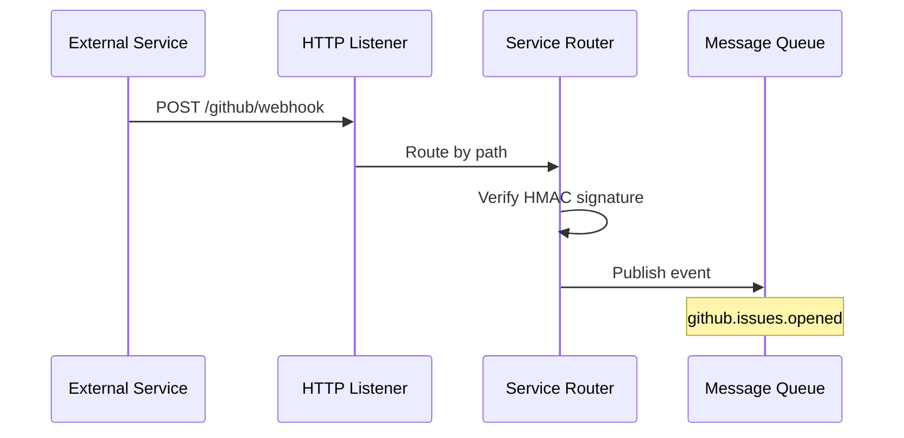
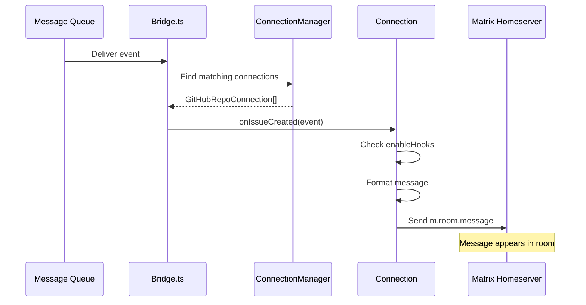
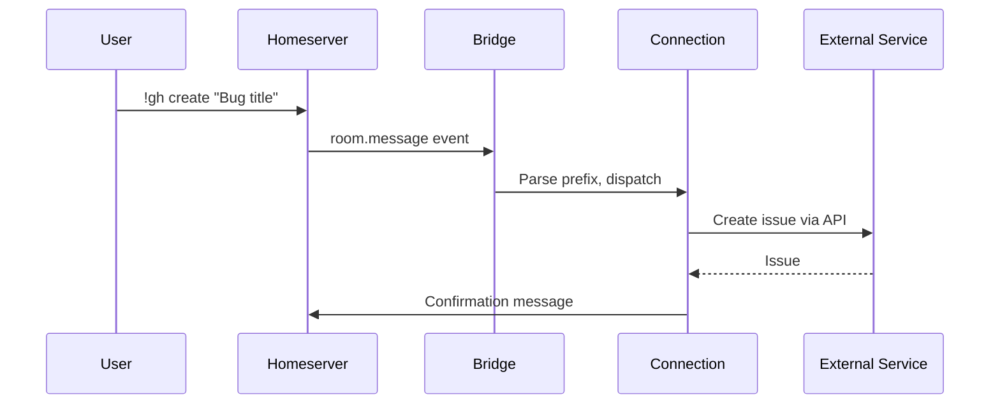

# Event Lifecycle

Hookshot processes events in two directions. Inbound: an external service sends a webhook, hookshot transforms it and delivers a Matrix message. Outbound: a user sends a command in a Matrix room, hookshot executes an action on an external service.

Understanding these two flows explains most of hookshot's behavior.

## Inbound: External Service to Matrix

An external event (GitHub PR opened, GitLab MR merged, JIRA ticket created) becomes a Matrix message through this pipeline:

**Phase 1: Webhook reception and verification**



**Phase 2: Event dispatch and delivery**



> **Source:** [`src/Webhooks.ts:17-166`](https://github.com/matrix-org/matrix-hookshot/blob/main/src/Webhooks.ts#L17-L166) · [`src/Bridge.ts:299-1023`](https://github.com/matrix-org/matrix-hookshot/blob/main/src/Bridge.ts#L299-L1023) · [`src/MatrixSender.ts:53-91`](https://github.com/matrix-org/matrix-hookshot/blob/main/src/MatrixSender.ts#L53-L91)

### Step by step

**1. HTTP reception** — External services POST webhooks to hookshot's HTTP listener. Each service has a dedicated path:

| Path | Service | Router |
|---|---|---|
| `/github/webhook` | GitHub | GitHubWebhooksRouter |
| `/gitlab` | GitLab | GitLabWebhooksRouter |
| `/jira/events` | JIRA | JiraWebhooksRouter |
| `/figma/webhook` | Figma | FigmaWebhooksRouter |
| `/webhook/{hookId}` | Generic webhooks | GenericWebhooksRouter |
| `/openproject` | OpenProject | OpenProjectWebhooksRouter |

> **Source:** [`src/Webhooks.ts:68-100`](https://github.com/matrix-org/matrix-hookshot/blob/main/src/Webhooks.ts#L68-L100)

**2. Signature verification** — Each service router verifies the webhook is authentic. GitHub uses HMAC-SHA256 via `x-hub-signature-256`. GitLab uses a secret token header. JIRA and others have their own mechanisms.

> **Source:** [`src/github/Router.ts:74-99`](https://github.com/matrix-org/matrix-hookshot/blob/main/src/github/Router.ts#L74-L99)

**3. Message queue** — The verified payload is emitted to the internal message queue with a topic name following the pattern `{service}.{event}.{action}`. Examples: `github.issues.opened`, `gitlab.merge_request.close`, `jira.issue_created`.

**4. Bridge dispatch** — `Bridge.ts` subscribes to all service topics. For each topic, a `bindHandlerToQueue` call defines: which connection type handles it, how to find the right connection instances, and which method to call.

There are **45+ handler bindings** across all services:
- GitHub: 15 bindings (issues, PRs, pushes, releases, workflows, discussions)
- GitLab: 12 bindings (merge requests, issues, pushes, tags, wiki, releases, notes)
- JIRA: 5 bindings (issues, versions)
- Figma: 1 binding (comments)
- Feeds: 3 bindings (entry, success, error)
- OpenProject: 2 bindings (work package created, updated)
- ChallengeHound: 1 binding (activity)
- Generic webhooks: 1 binding

> **Source:** [`src/Bridge.ts:299-1023`](https://github.com/matrix-org/matrix-hookshot/blob/main/src/Bridge.ts#L299-L1023)

**5. Connection lookup** — ConnectionManager finds all Connection instances interested in this event. For GitHub, this means finding all `GitHubRepoConnection` instances connected to the repository that generated the event.

**6. Handler execution** — The connection's handler method runs. It checks if the specific event type is enabled (e.g., the user may have disabled `push` events), formats the message with appropriate emoji and metadata, and sends it.

**7. Matrix delivery** — `MatrixSender` delivers the message to the Matrix room via the homeserver's client-server API. Messages are sent as `m.room.message` events with `msgtype: m.notice`.

### Event filtering

Not all events reach Matrix. Each connection instance has an `enableHooks` list that controls which event types produce messages. For example, a GitHub repo connection defaults to 13 of 23 possible event types.

> **Source:** [`src/Connections/GithubRepo.ts:205-218`](https://github.com/matrix-org/matrix-hookshot/blob/main/src/Connections/GithubRepo.ts#L205-L218)

### Message format

All hookshot messages share a common structure:

```json
{
  "msgtype": "m.notice",
  "body": "plain text version",
  "formatted_body": "<html version>",
  "format": "org.matrix.custom.html",
  "external_url": "https://link-to-source",
  "uk.half-shot.matrix-hookshot.{service}.{entity}": {
    "metadata": "about the source event"
  }
}
```

The `uk.half-shot.matrix-hookshot.*` fields carry structured metadata about the source event (repo, issue, PR, etc.). This enables Matrix clients to build rich displays.

> **Source:** [`src/FormatUtil.ts:60-134`](https://github.com/matrix-org/matrix-hookshot/blob/main/src/FormatUtil.ts#L60-L134)

## Outbound: Matrix to External Service

A user sends a bot command in a Matrix room. Hookshot parses it, finds the right connection, and executes an action on the external service.



> **Source:** [`src/Bridge.ts:1338`](https://github.com/matrix-org/matrix-hookshot/blob/main/src/Bridge.ts#L1338) · [`src/BotCommands.ts:199`](https://github.com/matrix-org/matrix-hookshot/blob/main/src/BotCommands.ts#L199)

### Step by step

**1. Matrix event** — The homeserver delivers the room message to hookshot via the appservice transaction API.

**2. Command parsing** — `Bridge.onRoomMessage` finds connections in the room. Each connection type defines a command prefix (e.g., `!gh` for GitHub, `!gl` for GitLab, `!jira` for JIRA). The `BotCommands` system matches the message prefix and dispatches to the correct handler.

**3. Permission check** — Before executing, hookshot checks if the user has permission for this action via the `BridgePermissions` system.

> **Source:** [`src/config/permissions.rs`](https://github.com/matrix-org/matrix-hookshot/blob/main/src/config/permissions.rs)

**4. External API call** — The connection calls the external service API (Octokit for GitHub, axios for GitLab, etc.) using the appropriate credentials.

**5. Confirmation** — The connection sends a response message back to the Matrix room confirming the action.

### Available commands by service

| Service | Prefix | Commands |
|---|---|---|
| GitHub | `!gh` | `create`, `close`, `assign`, `workflow run` |
| GitLab | `!gl` | `create`, `create-confidential`, `close` |
| JIRA | `!jira` | `create`, `issue-types`, `assign` |
| OpenProject | `!op` | `create`, `close`, `priority`, `assign`, `responsible` |
| Setup | `!hookshot` | `github repo`, `gitlab project`, `jira project`, `webhook`, `feed`, ... |

> **Source:** [`src/Connections/`](https://github.com/matrix-org/matrix-hookshot/blob/main/src/Connections/) · [`src/AdminRoom.ts`](https://github.com/matrix-org/matrix-hookshot/blob/main/src/AdminRoom.ts)

## Emoji reactions

A special outbound flow: hookshot maps Matrix emoji reactions to actions on external services. This is currently implemented for GitHub.

| Emoji | Action |
|---|---|
| :thumbsup: :thumbsdown: :laugh: :tada: :heart: :rocket: :eyes: | Add GitHub reaction |
| :wastebasket: | Close issue |
| :raised_hand: | Reopen issue |
| :white_check_mark: | Approve PR |
| :x: :no_entry_sign: | Request changes on PR |

> **Source:** [`src/Connections/GithubRepo.ts`](https://github.com/matrix-org/matrix-hookshot/blob/main/src/Connections/GithubRepo.ts)

## Feed polling (special case)

RSS/Atom feeds don't use webhooks. Instead, hookshot polls feeds on an interval using a Rust-based feed parser. New entries produce `feed.entry` events on the message queue, which follow the same Connection handler path as webhook events.

> **Source:** [`src/feeds/parser.rs`](https://github.com/matrix-org/matrix-hookshot/blob/main/src/feeds/parser.rs) · [`src/Connections/FeedConnection.ts:244-284`](https://github.com/matrix-org/matrix-hookshot/blob/main/src/Connections/FeedConnection.ts#L244-L284)

## Failure behavior

| Failure | System behavior |
|---|---|
| Webhook signature invalid | HTTP 401 returned, no event processed |
| Connection not found for event | Event silently dropped (logged at debug level) |
| Event type disabled on connection | Event silently dropped |
| External API call fails (outbound) | Error message sent to Matrix room |
| Matrix message send fails | Error logged, message queue handles retry |
| Homeserver unreachable | Messages queued, retried when connection restored |

> ⚠️ **Assumption — retry behavior needs verification against MessageQueue implementation**

## Related

**Concepts:** [Integration Model](integration-model.md) · [What is Hookshot](what-is-hookshot.md) · [Trust and Boundaries](trust-and-boundaries.md) · [Glossary](glossary.md)

**Architecture:** [Connections](../architecture/connections.md) — Connection lifecycle and state · [State and Storage](../architecture/state-and-storage.md) — How data persists

**Integrations:** [Overview](../integrations/overview.md) · [GitHub](../integrations/github.md) · [Generic Webhooks](../integrations/generic-webhooks.md)

**Reference:** [Bot Commands](../reference/bot-commands.md) · [Event Types](../reference/event-types.md) · [Matrix Spec Map](../reference/matrix-spec-map.md)

**Tutorials:** [First Webhook](../get-started/first-webhook.md) · [First GitHub Notification](../get-started/first-github-notification.md)

**Matrix Spec:** [Application Service API](https://spec.matrix.org/latest/application-service-api/) · [Room State Events](https://spec.matrix.org/latest/client-server-api/#room-state)
