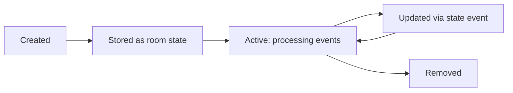

# Integration Model

Every hookshot integration — GitHub, GitLab, JIRA, webhooks, feeds — follows the same pattern. Understanding this pattern once means you can predict how any integration works.

## The Connection

A **connection** is a binding between a Matrix room and an external resource. It defines:

- **What to watch** — which external events to deliver as Matrix messages
- **What to accept** — which bot commands to handle
- **How to authenticate** — credentials for the external service
- **Where to store config** — as a Matrix room state event

One room can have multiple connections. One external resource can be connected to multiple rooms.

```
Matrix Room                         External Services
┌──────────────────────┐
│ #backend:example.com │───── GitHub: org/backend (PRs, issues)
│                      │───── Generic webhook: CI alerts
│                      │───── RSS: team blog
└──────────────────────┘

┌──────────────────────┐
│ #frontend:example.com│───── GitHub: org/frontend (PRs only)
│                      │───── GitLab: org/design-system
└──────────────────────┘
```

## Every connection has the same lifecycle



1. **Created** — via bot command, widget, provisioning API, or direct state event
2. **Stored** — configuration written as a Matrix room state event (e.g., `uk.half-shot.matrix-hookshot.github.repository`)
3. **Active** — hookshot routes matching events to the connection's handlers
4. **Updated** — new state event overwrites the old one; connection reconfigures
5. **Removed** — state event cleared; connection deregistered

The state event **is** the connection. When hookshot restarts, it reads all room state events and reconstructs every connection. No external database.

> **Source:** [`src/Connections/IConnection.ts:30-117`](https://github.com/matrix-org/matrix-hookshot/blob/main/src/Connections/IConnection.ts#L30-L117) · [`src/Bridge.ts:1024-1115`](https://github.com/matrix-org/matrix-hookshot/blob/main/src/Bridge.ts#L1024-L1115)

## Every connection has the same capabilities (in theory)

| Capability | Meaning | Example |
|---|---|---|
| **Inbound events** | External service → Matrix message | GitHub PR opened → room notification |
| **Outbound commands** | Bot command → external API call | `!gh create "Bug"` → GitHub issue |
| **Provisioning** | Create/update/delete via API or UI | Widget form → new connection |
| **State storage** | Config stored as room state event | `enableHooks: ["issue.created"]` |

Not every connection implements all capabilities. Feeds have no outbound commands. Generic webhooks have no OAuth. But the model is the same.

## Four ways to create a connection

| Method | Who uses it | How |
|---|---|---|
| **Bot command** | Room users | `!hookshot github repo https://github.com/org/repo` |
| **Widget UI** | Room users | Click through the embedded web form |
| **Provisioning API** | Developers | `POST /widgetapi/v1/{roomId}/connections/GitHubRepo` |
| **Static config** | Operators | Pre-define connections in `config.yml` |

All four paths end the same way: a state event is written to the room.

> **Source:** [`src/Connections/SetupConnection.ts`](https://github.com/matrix-org/matrix-hookshot/blob/main/src/Connections/SetupConnection.ts) · [`src/widgets/BridgeWidgetApi.ts`](https://github.com/matrix-org/matrix-hookshot/blob/main/src/widgets/BridgeWidgetApi.ts)

## How events route to connections

When an external event arrives (a webhook, a feed update), hookshot must find which connection(s) should handle it.

1. **Service router** identifies the service (GitHub, GitLab, etc.) from the URL path
2. **Event payload** identifies the specific resource (which repo, which project)
3. **ConnectionManager** looks up all connections matching that resource
4. Each matching connection's **handler** is called

A GitHub webhook for `org/repo` will reach every `GitHubRepoConnection` connected to `org/repo`, regardless of which room it's in. If three rooms are connected to the same repo, all three get the notification.

> **Source:** [`src/Bridge.ts:315-325`](https://github.com/matrix-org/matrix-hookshot/blob/main/src/Bridge.ts#L315-L325)

## How commands route to connections

When a user sends `!gh create "Bug"` in a room:

1. **Bridge** receives the room message via appservice API
2. **Command prefix** (`!gh`) identifies which connection type to target
3. **Room connections** are searched for a matching connection
4. The connection's **command handler** executes the action

If a room has both a GitHub and GitLab connection, `!gh` goes to GitHub and `!gl` goes to GitLab. Each connection type defines its own prefix.

> **Source:** [`src/BotCommands.ts:199-302`](https://github.com/matrix-org/matrix-hookshot/blob/main/src/BotCommands.ts#L199-L302) · [`src/Bridge.ts:1338`](https://github.com/matrix-org/matrix-hookshot/blob/main/src/Bridge.ts#L1338)

## The pattern is the same for every service

| | GitHub | GitLab | JIRA | Generic Webhook | RSS Feed |
|---|---|---|---|---|---|
| **Inbound source** | GitHub App webhook | GitLab webhook | JIRA webhook | Any HTTP POST | Polling |
| **State event** | `...github.repository` | `...gitlab.repository` | `...jira.project` | `...generic.hook` | `...feed` |
| **Command prefix** | `!gh` | `!gl` | `!jira` | — | — |
| **Auth** | GitHub App + OAuth | Token | OAuth 2.0/1.0 | URL-based | None |
| **Provisioning** | All 4 methods | All 4 methods | All 4 methods | All 4 methods | All 4 methods |

The differences are in the details (which events, which commands, which auth flow). The architecture is identical.

## Related

- [What is Hookshot](what-is-hookshot.md) — System overview
- [Event Lifecycle](event-lifecycle.md) — How events flow
- [Architecture: Connections](../architecture/connections.md) — Deep dive into the Connection abstraction
- [Integration Overview](../integrations/overview.md) — All services and capabilities
