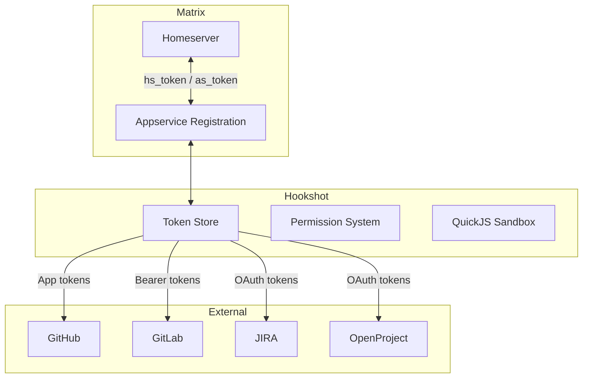

# Trust and Boundaries

Hookshot sits at the intersection of two trust domains: Matrix and external services. Understanding where trust boundaries are — and how credentials flow — is essential for secure deployment.

## Trust boundary diagram



**Trust domains:**
- **Matrix** (blue): Homeserver + appservice registration. Authenticated via `hs_token`/`as_token`.
- **Hookshot** (green): Token store (encrypted PEM), permission system (Rust NAPI), QuickJS sandbox.
- **External** (orange): Each service has its own credentials stored in hookshot's encrypted token store.

## Matrix side: Appservice authentication

Hookshot registers with the homeserver as an **application service**. This is a privileged relationship:

| Credential | Purpose | Risk if compromised |
|---|---|---|
| `as_token` | Hookshot authenticates to homeserver | Full access to impersonate bot users |
| `hs_token` | Homeserver authenticates to hookshot | Can send fake events to hookshot |

These tokens are in `registration.yaml`. Both hookshot and the homeserver must have copies.

The appservice can:
- Send messages as bot users (`@hookshot:domain`, `@_github_*:domain`, etc.)
- Read events in rooms where the bot is a member
- Create and manage rooms
- Cannot read events in rooms where the bot is not a member

> **Source:** [`src/Bridge.ts:1175`](https://github.com/matrix-org/matrix-hookshot/blob/main/src/Bridge.ts#L1175)
<!-- Spec: https://spec.matrix.org/latest/application-service-api/ -->

## External service side: Per-service auth

Each external service uses its own authentication model:

### GitHub

| Credential | Type | Stored where | Scope |
|---|---|---|---|
| App private key | RSA PEM file | Filesystem | Instance-wide: all webhook delivery + API access |
| Webhook secret | HMAC key | config.yml | Instance-wide: webhook signature verification |
| User OAuth tokens | Bearer tokens | Token store (encrypted) | Per-user: actions under user's identity |
| Personal access tokens | API tokens | Token store (encrypted) | Per-user: alternative to OAuth |

The GitHub App is the most privileged credential. It can read/write issues, PRs, and discussions on every repo where the App is installed.

> **Source:** [`src/github/GithubInstance.ts:65-71`](https://github.com/matrix-org/matrix-hookshot/blob/main/src/github/GithubInstance.ts#L65-L71) · [`src/github/AdminCommands.ts:12-40`](https://github.com/matrix-org/matrix-hookshot/blob/main/src/github/AdminCommands.ts#L12-L40)

### GitLab

| Credential | Type | Stored where | Scope |
|---|---|---|---|
| Instance token | Personal access token | Account data (per-user) | Per-user: API access to their GitLab |

No instance-wide credential. Each user provides their own token.

### JIRA

| Credential | Type | Stored where | Scope |
|---|---|---|---|
| OAuth 2.0 tokens (Cloud) | Bearer + refresh | Token store (encrypted) | Per-user |
| OAuth 1.0 tokens (Server) | RSA-signed | Token store (encrypted) | Per-user |

### OpenProject

| Credential | Type | Stored where | Scope |
|---|---|---|---|
| OAuth 2.0 tokens | Bearer + refresh | Token store (encrypted) | Per-user |

## Token store

User credentials (OAuth tokens, personal access tokens) are stored in an encrypted file on disk.

- **Encryption:** RSA key from `passFile` in config
- **Location:** Configured via `passFile` path
- **Format:** Encrypted JSON

The `passFile` RSA key is the master secret. If compromised, all stored tokens are exposed.

> **Source:** [`src/tokens/mod.rs`](https://github.com/matrix-org/matrix-hookshot/blob/main/src/tokens/mod.rs)

## Permission system

Hookshot's permission system controls who can do what. It runs in Rust via NAPI for performance.

```yaml
permissions:
  - actor: example.com           # All users on this domain
    services:
      - service: "*"             # All services
        level: admin             # Full access
  - actor: "@user:example.com"   # Specific user
    services:
      - service: github
        level: commands           # Can run bot commands only
```

Permission levels (ascending): `login` < `notifications` < `commands` < `manageConnections` < `admin`

> **Source:** [`src/config/permissions.rs`](https://github.com/matrix-org/matrix-hookshot/blob/main/src/config/permissions.rs) · [`src/config/Config.ts`](https://github.com/matrix-org/matrix-hookshot/blob/main/src/config/Config.ts)

### What each level allows

| Level | Can do |
|---|---|
| `login` | Authenticate with external services |
| `notifications` | Receive notifications |
| `commands` | Run bot commands (create issues, etc.) |
| `manageConnections` | Create and remove connections |
| `admin` | Full administrative access |

## Webhook verification

Inbound webhooks are verified differently per service:

| Service | Method | What hookshot checks |
|---|---|---|
| GitHub | HMAC-SHA256 | `x-hub-signature-256` header against configured secret |
| GitLab | Secret token | `X-Gitlab-Token` header against configured secret |
| JIRA | — | Payload structure validation |
| Generic webhooks | None | URL contains unique UUID (knowledge = access) |
| Figma | — | Payload structure validation |

Generic webhooks have **no signature verification**. The unique UUID in the URL is the only protection. Treat webhook URLs as secrets.

> **Source:** [`src/github/Router.ts:74-99`](https://github.com/matrix-org/matrix-hookshot/blob/main/src/github/Router.ts#L74-L99) · [`src/Connections/GenericHook.ts:315`](https://github.com/matrix-org/matrix-hookshot/blob/main/src/Connections/GenericHook.ts#L315)

## Transformation function sandbox

User-supplied JavaScript transformation functions run in a **QuickJS sandbox** (WebAssembly). This is a security boundary:

| Allowed | Blocked |
|---|---|
| Read webhook payload (`data` variable) | Network access |
| String manipulation | Filesystem access |
| JSON operations | Module imports |
| Return formatted message | Process spawning |

Functions are killed after 500ms.

> **Source:** [`src/Connections/GenericHook.ts:421-422`](https://github.com/matrix-org/matrix-hookshot/blob/main/src/Connections/GenericHook.ts#L421-L422)

## What to protect

| Asset | Risk | Mitigation |
|---|---|---|
| `registration.yaml` (as_token, hs_token) | Full bot impersonation | File permissions, don't commit to git |
| `passFile` (RSA key) | All stored tokens exposed | File permissions, don't commit to git |
| GitHub App private key | Full API access to installed repos | File permissions, rotate periodically |
| Webhook secrets | Spoofed webhook events | Strong random values, keep in config only |
| Generic webhook URLs | Unauthorized message injection | Treat as secrets, use expiration dates |
| config.yml | Contains secrets in plaintext | File permissions, don't commit to git |

## Related

- [What is Hookshot](what-is-hookshot.md) — System overview
- [Integration Model](integration-model.md) — How integrations work
- [GitHub Integration](../integrations/github.md) — GitHub auth details
- [Operator: Hardening](../guides/operator/hardening.md) — Security configuration
- [Matrix Spec: Application Service API](https://spec.matrix.org/latest/application-service-api/)
