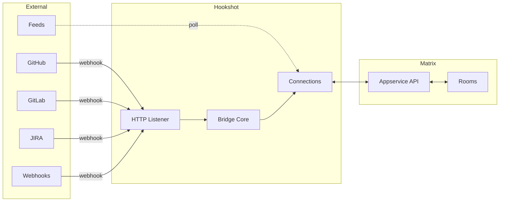

# What is Hookshot

Hookshot is a Matrix [application service](https://spec.matrix.org/latest/application-service-api/) that connects Matrix rooms to external services. It receives events from services like GitHub, GitLab, and JIRA, and delivers them as messages in Matrix rooms. It accepts commands from Matrix rooms and executes actions on those services.

## Where hookshot sits

Hookshot registers with a Matrix homeserver (Synapse, Dendrite, Conduit) as an application service. The homeserver forwards room events to hookshot, and hookshot sends messages back through the homeserver's client-server API.

External services send webhooks to hookshot's HTTP listener. Hookshot routes each webhook to the correct Matrix room based on **connections** — the core abstraction.

## The core concept: Connections

A **connection** binds a Matrix room to an external resource. One room can have multiple connections. One GitHub repo can be connected to multiple rooms.

Examples:
- Room `#backend:example.com` connected to `github.com/org/backend` — receives PR and issue notifications, accepts `!gh` commands
- Room `#alerts:example.com` connected to a generic webhook endpoint — receives CI alerts via HTTP POST
- Room `#news:example.com` connected to an RSS feed — receives new articles

Connections are stored as **Matrix room state events**. No external database required. When hookshot restarts, it reconstructs all connections from room state.

See [Event Lifecycle](event-lifecycle.md) for how events flow through connections.

## What hookshot does

**Inbound (external service to Matrix):**
- GitHub: PR notifications, issue updates, push summaries, release announcements, workflow status, discussion threads
- GitLab: Merge request events, issue events, pushes, tags, wiki changes, releases
- JIRA: Issue creation and updates, version events
- Generic webhooks: Any HTTP payload, with optional JavaScript transformation
- RSS/Atom: New feed entries
- Figma: File comment notifications
- OpenProject: Work package events
- ChallengeHound: Activity tracking

**Outbound (Matrix to external service):**
- Create, close, assign issues (GitHub, GitLab, JIRA, OpenProject)
- Trigger GitHub Actions workflows
- Map emoji reactions to GitHub actions (approve PRs, close issues)
- Forward room messages to external HTTP endpoints (outbound hooks)

**Management:**
- Web widget UI for configuring connections in Matrix clients
- REST provisioning API for programmatic management
- Bot commands for setup and administration
- Per-user OAuth for actions that should use the user's identity

## What hookshot is NOT

- **Not a full sync bridge.** Hookshot delivers notifications and accepts commands. It does not mirror entire conversation histories between Matrix and external services.
- **Not a generic Matrix bot framework.** Hookshot is specifically designed for service integration. For general-purpose bots, use matrix-bot-sdk directly.
- **Not stateless.** Hookshot maintains connection state (via Matrix room state events) and credential state (via an encrypted token store). It needs persistent storage.

## Key numbers

| Metric | Count |
|---|---|
| External services supported | 8 |
| Connection types | 15 |
| Inbound event handler bindings | 45+ |
| Bot command definitions | 66 |
| Configuration keys | 35+ |
| Rust NAPI modules | 8 |

> **Source:** [`src/Connections/`](https://github.com/matrix-org/matrix-hookshot/blob/main/src/Connections/) · [`src/Bridge.ts:299-1023`](https://github.com/matrix-org/matrix-hookshot/blob/main/src/Bridge.ts#L299-L1023)

## Technology

- **Runtime:** Node.js (TypeScript)
- **Performance-critical modules:** Rust via NAPI-rs (feed parsing, token encryption, formatting, permissions)
- **Matrix SDK:** matrix-appservice-bridge + matrix-bot-sdk (Element fork)
- **Webhook sandbox:** QuickJS (JavaScript transformation functions run in a WASM sandbox)
- **Build:** Vite (TypeScript), Cargo (Rust)

## Next steps

| I want to... | Read |
|---|---|
| Understand how events flow through hookshot | [Event Lifecycle](event-lifecycle.md) |
| See what each integration can do | [Integration Overview](../integrations/overview.md) |
| Try hookshot in 5 minutes | [Quickstart](../get-started/quickstart.md) |
| Deploy hookshot to production | [Installation Guide](../guides/operator/installation.md) |
| Understand the internal architecture | [Architecture: Connections](../architecture/connections.md) |

## Related

- [Event Lifecycle](event-lifecycle.md) — How events flow through the system
- [Integration Overview](../integrations/overview.md) — All services and capabilities
- [Architecture: Connections](../architecture/connections.md) — The Connection abstraction in depth
- [Matrix Spec: Application Service API](https://spec.matrix.org/latest/application-service-api/) — How hookshot connects to homeservers
